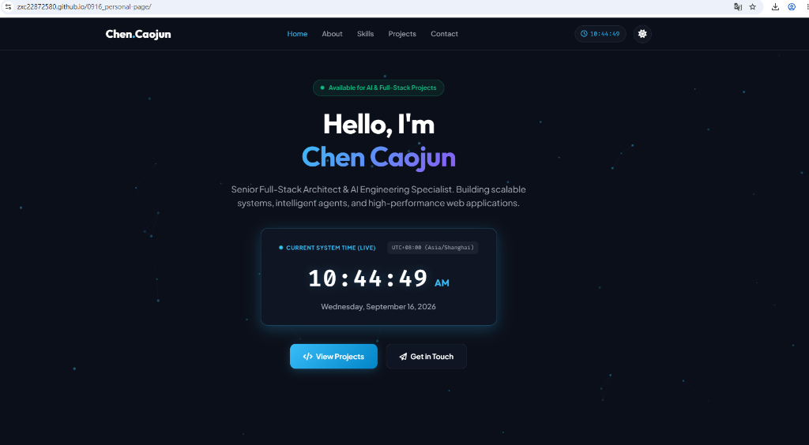

# Chen Caojun - Personal Web Page

Personal portfolio and interactive web page for **Chen Caojun** (陈曹军), featuring a real-time system clock, dynamic particle background, dark/light theme switcher, technical skills breakdown, and project gallery.

## 🚀 Live Demo

Check out the live interactive website here:  
👉 **[https://zxc22872580.github.io/0916_personal-page/](https://zxc22872580.github.io/0916_personal-page/)**



---

## ✨ Key Features

- **Live Ticking System Clock:** Real-time clock widget displaying local time, AM/PM, full date, and UTC+08:00 (Asia/Shanghai) timezone indicator.
- **Dark / Light Theme Switcher:** One-click theme toggle persisted in `localStorage`.
- **Interactive Particle Background:** Ambient HTML5 canvas particle network reacting to resolution and system theme.
- **Responsive Glassmorphism UI:** Built with vanilla HTML, modern CSS custom properties, and ESNext JavaScript.

---

## 🛠️ Project Structure

```
.
├── demo.png     # Live demo preview screenshot
├── index.html   # Main HTML5 structure
├── style.css    # CSS design system & theme variables
└── script.js    # Live clock, theme switcher, & particle canvas logic
```

---

## 💻 Tech Stack

- **HTML5 & CSS3** (Vanilla CSS, CSS Grid/Flexbox, Custom Properties)
- **JavaScript** (ES6+ Canvas API, LocalStorage, Timers)
- **Google Fonts** (Outfit, Plus Jakarta Sans, Fira Code)
- **FontAwesome** (Icons)
